# Ride Share

A modern ride-sharing web application with a public marketing site and role-based portals for riders, drivers, and admins. End-to-end flows are covered with Playwright testing.

[](#)
[](#)
[](#)
[](#)
[](#)
[](#)
[](#)
[](#)
[](#)
[](#)
[](#)
[](#)
[](#)
[](#)
[](https://nominatim.org/)

---

## Table of contents

- [Overview](#overview)
- [Features](#features)
- [Screenshots](#screenshots)
  - [Landing page](#landing-page)
  - [Admin portal](#admin-portal)
  - [Rider portal](#rider-portal)
  - [Book a ride](#book-a-ride)
  - [Driver portal](#driver-portal)
- [Tech stack](#tech-stack)
- [Project structure](#project-structure)
- [Book a ride (code guide)](docs/book-a-ride.md)

---

## Overview

Ride Share helps people book intercity and long-distance trips with transparent pricing. The frontend includes:

- A polished marketing landing page for discovery and conversion
- Secure login and registration
- Separate dashboards for **Admin**, **Rider**, and **Driver** roles
- **Book a ride** with Leaflet maps, Nominatim place search, OSRM route estimate, and live tracking
- Real-time announcements and ride updates powered by Pusher
- Playwright end-to-end tests for critical user flows such as login and registration

This repository is the **Next.js frontend**. It connects to a NestJS API backend for authentication, user management, rides, and portal data.

For a file-by-file walkthrough of booking, see [docs/book-a-ride.md](docs/book-a-ride.md).

---

## Features

| Area | What it does |
|------|----------------|
| Marketing site | Hero, feature highlights, testimonials, FAQ, and call-to-action |
| Authentication | Cookie-based sessions with role-aware redirects into the correct portal |
| Admin portal | Account totals chart, admin management, announcements, profile updates |
| Book a ride | Map pickup, Nominatim destination search, car/bike, route + fare, confirm |
| Rider portal | Dashboard, active ride tracking, cancel, profile editing |
| Driver portal | Go online (GPS), accept open requests, start / complete / cancel trips |
| Realtime | Announcements plus ride status and driver location over Pusher |
| Testing | Playwright coverage for key authentication and page flows |

---

## Screenshots

### Landing page

#### Hero

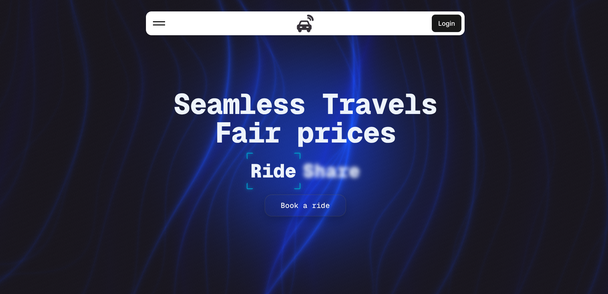

#### Navigation

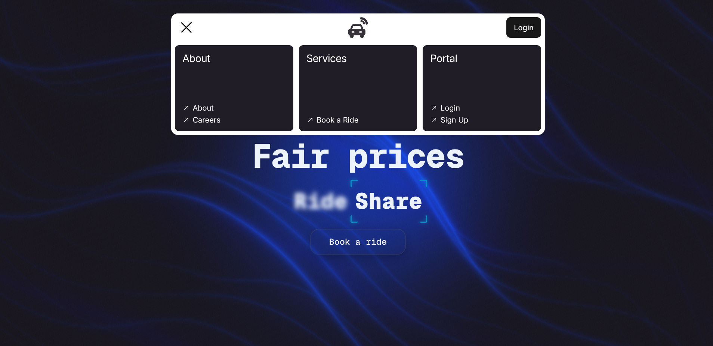

#### Features

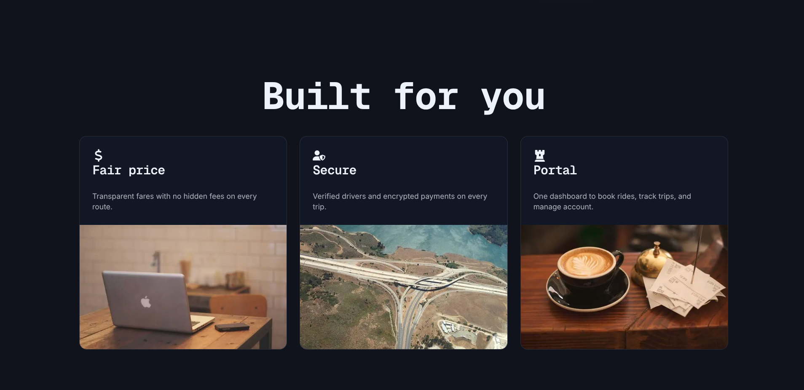

#### Image carousel

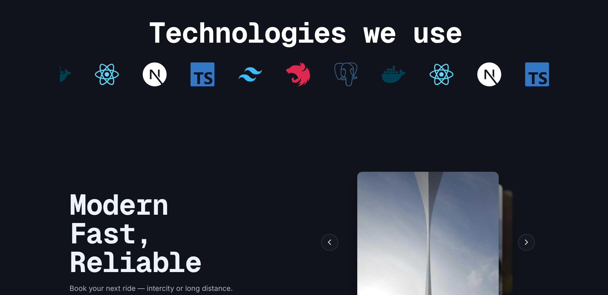

#### Testimonials

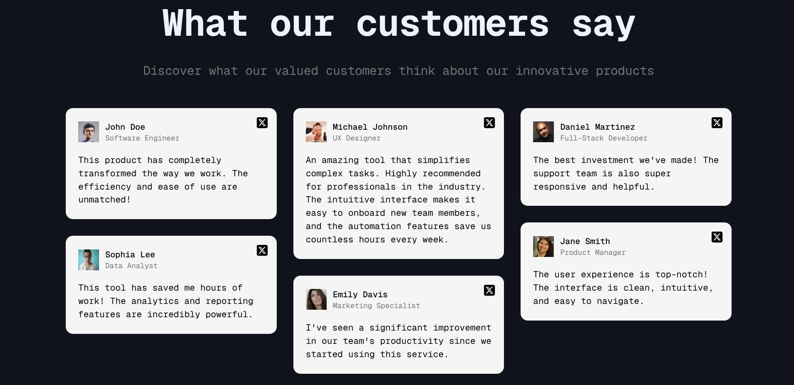

#### Call to action and FAQ

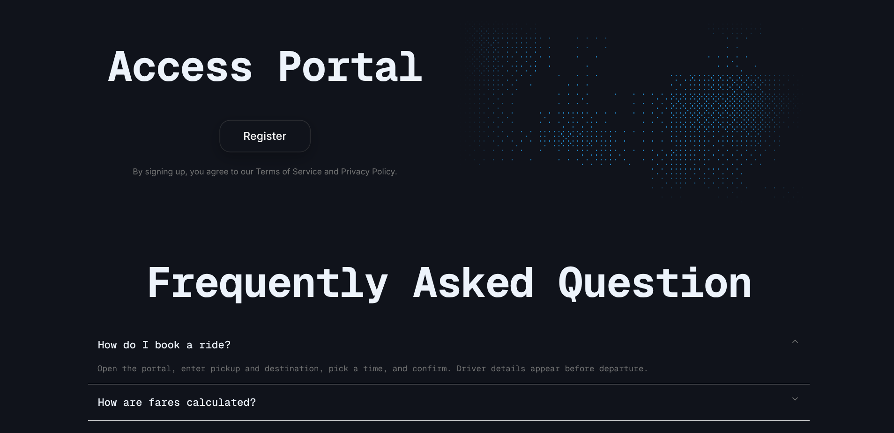

#### FAQ and footer

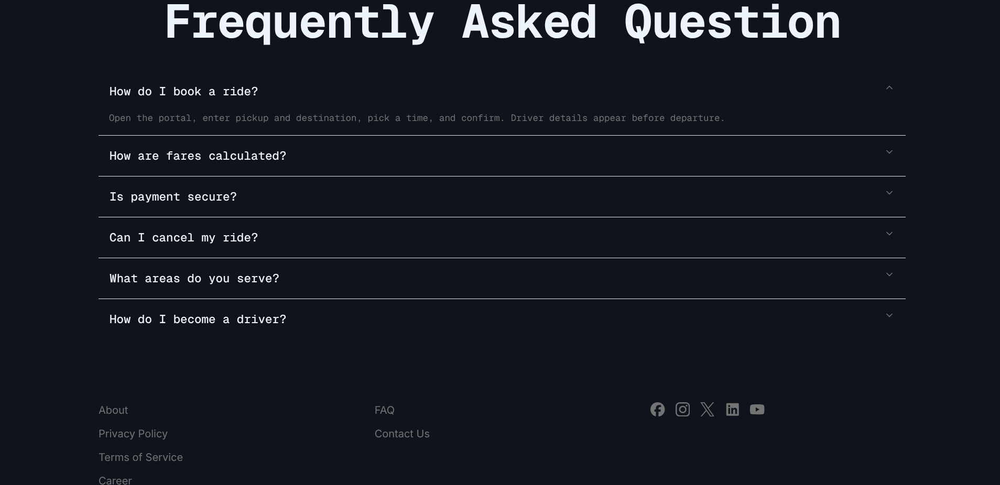

### Admin portal

#### Dashboard

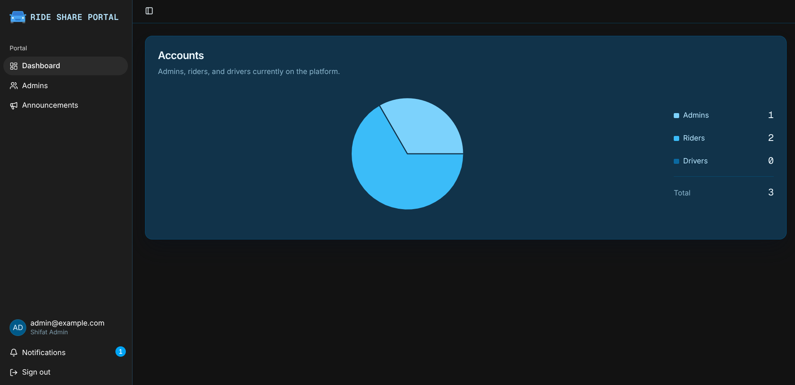

#### Manage admins

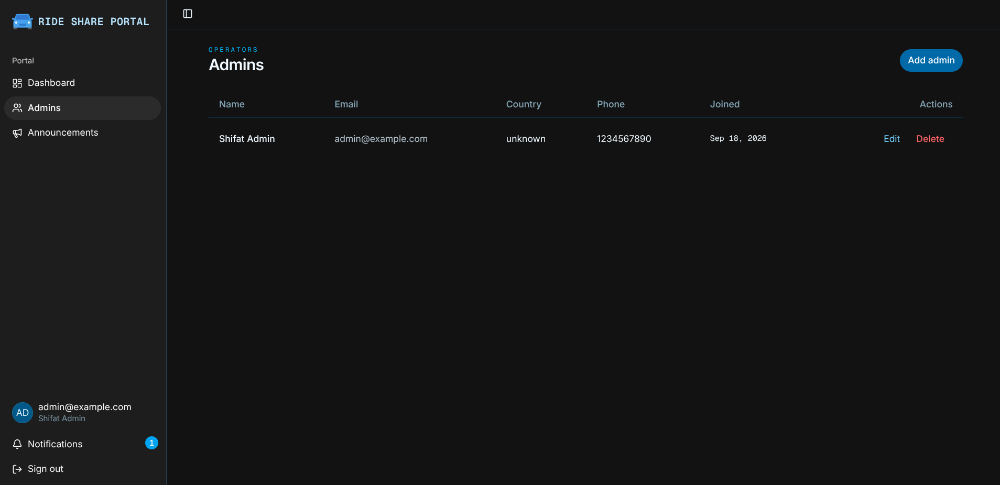

#### Manage announcements

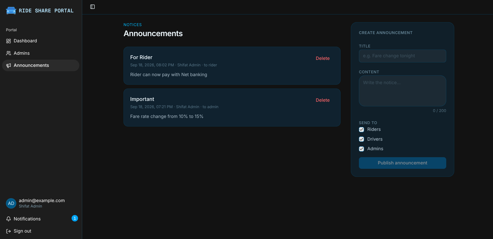

#### Update profile

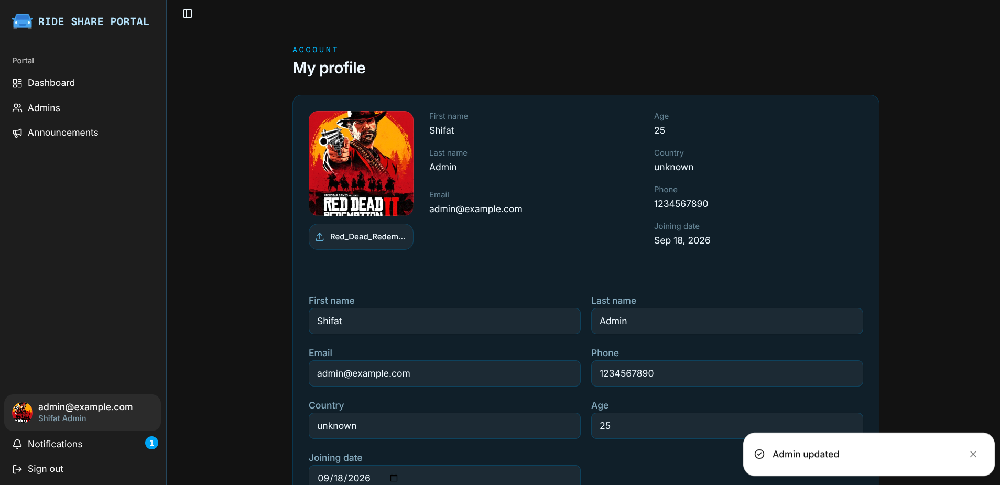

### Rider portal

#### Dashboard

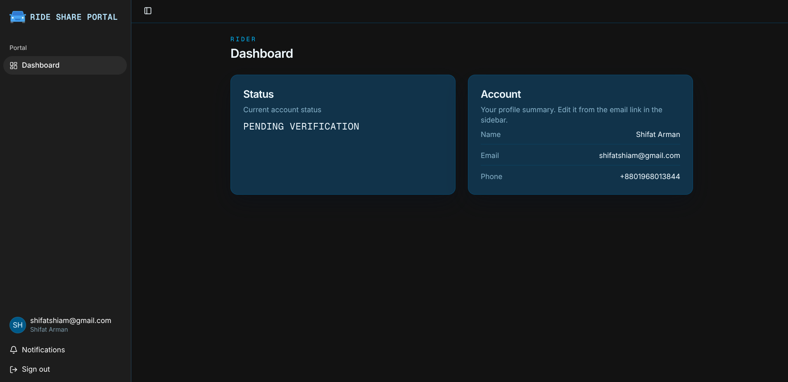

#### Update profile

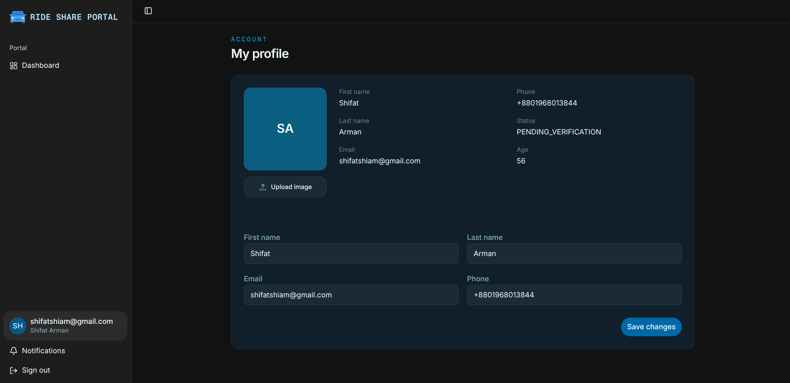

### Book a ride

#### Booking map (destination search)

Rider picks a destination via Nominatim-backed search on a Leaflet / OpenStreetMap map, then chooses **Car** or **Bike**.

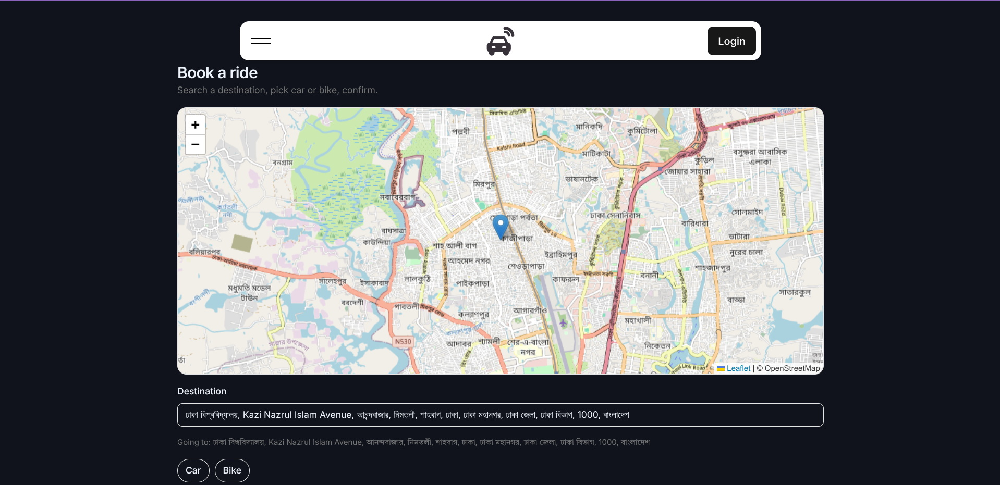

#### Rider tracking (SEARCHING)

After confirm, the track page redraws pickup, destination, and the OSRM route polyline while status is `SEARCHING`.

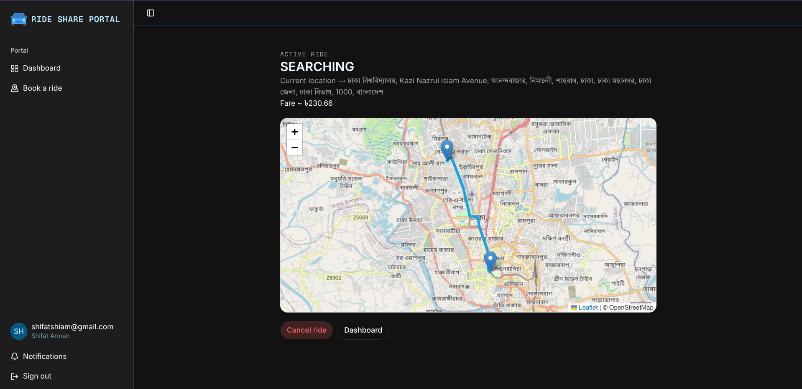

#### Rider tracking (IN_PROGRESS)

Once the trip has started, the rider sees `IN_PROGRESS` with the same route on the map.

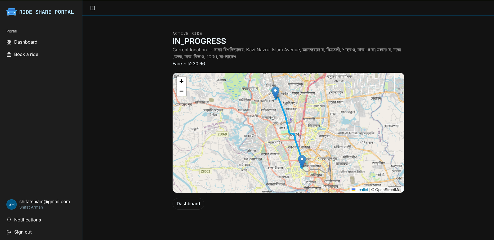

### Driver portal

#### Open requests (accept)

Drivers who are online see open `SEARCHING` rides and can **Accept**.

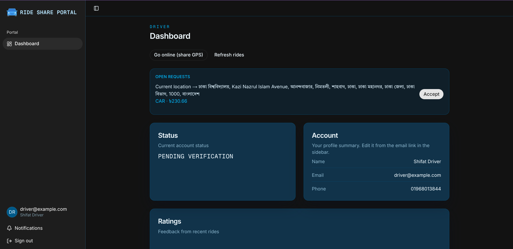

#### Assigned ride (start trip)

After accept (or auto-assign), the driver gets **Start trip** / **Cancel** for an `ACCEPTED` ride.

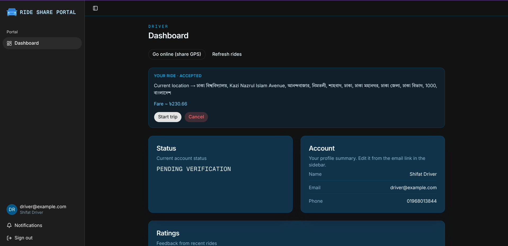

---

## Tech stack

| Layer | Tools |
|-------|--------|
| Framework | Next.js 16 (App Router), React 19 |
| Language | TypeScript |
| Styling | Tailwind CSS 4, shadcn/ui |
| Animation | GSAP, Motion, Three.js / OGL |
| Maps | Leaflet, OpenStreetMap tiles, Nominatim (via API), OSRM estimate (via API) |
| Data & validation | Axios, Zod |
| Charts | Recharts |
| Realtime | Pusher |
| Testing | Playwright |
| Runtime / deploy | Bun, Vercel |

---

## Project structure

```text
app/
  (website)/              Public marketing pages, login, register, book-a-ride
  portal/rider/           Rider dashboard + ride/[id] tracking
  portal/driver/          Driver dashboard (accept / start / complete)
  portal/admin/           Admin tools
components/book-ride/     Book-a-ride map UI
api/                      Axios clients (auth, rides, location, …)
lib/pusher-client.ts      Announcements + ride channels
docs/
  screenshots/            README screenshots
  book-a-ride.md          How book-a-ride works in code
```
