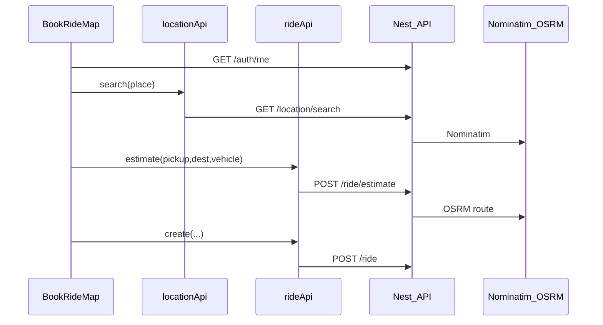

# Book a ride — how it works in code

This guide explains the **frontend** book-a-ride flow: which files own each step, which Nest endpoints they call, and how status moves from search to trip complete.

Screenshots live in [`screenshots/`](screenshots/) and are embedded from the root [README](../README.md).

---

## High-level flow

```text
Rider opens /book-a-ride
  → auth gate (rider only)
  → Leaflet map + geolocation pickup
  → Nominatim search (via API) for destination
  → pick Car | Bike
  → POST /ride/estimate (OSRM route + fare) → draw polyline
  → POST /ride (create) → SEARCHING or ACCEPTED
  → /portal/rider/ride/[id] track page (re-estimate polyline + Pusher)

Driver dashboard
  → optional GPS: PATCH /location/driver/me
  → list SEARCHING / active ride
  → accept → start → complete (or cancel)
```



---

## Entry points

| Path | File | Role |
|------|------|------|
| `/book-a-ride` | [`app/(website)/book-a-ride/page.tsx`](../app/(website)/book-a-ride/page.tsx) | Thin page; renders the map client |
| Map UI | [`components/book-ride/book-ride-map.tsx`](../components/book-ride/book-ride-map.tsx) | Auth, map, search, estimate, confirm |
| Marketing CTA | [`components/Hero.tsx`](../components/Hero.tsx), [`config/nav-items.ts`](../config/nav-items.ts) | Links to `/book-a-ride` |
| Login `?next=` | [`app/(website)/login/page.tsx`](../app/(website)/login/page.tsx) | Riders may return to `/book-a-ride` after login |

Only **riders** stay on the book page. Other roles are redirected to their portal dashboard via `authApi.me()` + `dashboardPathForRole`.

---

## API clients

### Place search — [`api/location.ts`](../api/location.ts)

```ts
locationApi.search(place)          // GET /location/search?place=
locationApi.updateMyLocation(lat, lng) // PATCH /location/driver/me
```

- **Nominatim** is not called from the browser. The Nest backend proxies Nominatim so CORS and User-Agent rules stay server-side.
- Drivers use `updateMyLocation` when they click **Go online (share GPS)** on the driver dashboard.

### Rides — [`api/rides.ts`](../api/rides.ts)

| Method | HTTP | Used by |
|--------|------|---------|
| `estimate` | `POST /ride/estimate` | Book map + track page (polyline) |
| `create` | `POST /ride` | Confirm booking |
| `getActive` | `GET /ride/active` | Rider / driver dashboards |
| `getSearching` | `GET /ride/searching` | Driver open-request list |
| `getById` | `GET /ride/:id` | Track page |
| `accept` / `start` / `complete` / `cancel` | `POST /ride/:id/...` | Driver (and cancel for rider) |

Estimate response includes `geometry` as GeoJSON `[lng, lat][]`. Leaflet needs `[lat, lng]`, so the UI maps coordinates before `L.polyline(...)`.

---

## Book map (`book-ride-map.tsx`)

Owned concerns, in order:

1. **Auth** — `authApi.me()`; non-riders leave; unauthenticated users go to `/login?next=/book-a-ride`.
2. **Map** — Leaflet + OSM tiles; default / geolocation pickup marker.
3. **Destination** — debounced `locationApi.search`; selecting a result sets destination marker and clears the dropdown (skips re-search when the query equals the chosen address).
4. **Vehicle** — `CAR` or `BIKE` toggles.
5. **Estimate** — when pickup + destination + vehicle exist, `rideApi.estimate` runs; blue polyline + distance / ETA / fare.
6. **Confirm** — `rideApi.create`; success UI links to `/portal/rider/ride/{id}`.

Confirm stays disabled until an estimate succeeds (so the rider always sees a route before booking).

---

## Track ride (rider)

| File | Purpose |
|------|---------|
| [`app/portal/rider/ride/[id]/page.tsx`](../app/portal/rider/ride/[id]/page.tsx) | Route shell |
| [`app/portal/rider/ride/[id]/ride-client.tsx`](../app/portal/rider/ride/[id]/ride-client.tsx) | Map, cancel, live updates |

Important detail: route geometry is **not** stored on the `Ride` row. Leaving the book page drops the in-memory polyline. The track client **calls `rideApi.estimate` again** with the saved pickup / destination / vehicle so the route reappears.

Live updates:

- Pusher channel `ride-{id}` via [`subscribeRideChannel`](../lib/pusher-client.ts) (`ride-status`, `driver-location`)
- Polling `getById` every few seconds as a fallback if Pusher is missing

Rider dashboard ([`app/portal/rider/dashboard/page.tsx`](../app/portal/rider/dashboard/page.tsx)) shows an **Active ride** card from `rideApi.getActive()` with a link to the track page.

---

## Driver dashboard

[`app/portal/driver/dashboard/page.tsx`](../app/portal/driver/dashboard/page.tsx):

1. **Go online** — geolocation timer → `locationApi.updateMyLocation` (marks the driver findable for matching).
2. **Open requests** — `getSearching()` + **Accept**.
3. **Your ride** — `getActive()`; **Start trip** / **Complete** / **Cancel**.
4. **Pusher** — `subscribeDriverRideAssigned(driverId)` for `ride-assigned` notifications.

---

## Status lifecycle (frontend view)

| Status | Rider UI | Driver UI |
|--------|----------|-----------|
| `SEARCHING` | Track page, cancel allowed | Listed under open requests |
| `ACCEPTED` | Track page, cancel allowed | Start / cancel |
| `IN_PROGRESS` | Track page (no cancel in UI) | Complete |
| `COMPLETED` / `CANCELLED` | Terminal | Terminal |

Matching (nearest online driver with vehicle type) happens on the **backend** during `POST /ride`. If nobody is nearby, the ride stays `SEARCHING` until a driver accepts.

---

## Realtime helpers

[`lib/pusher-client.ts`](../lib/pusher-client.ts):

- `subscribeRoleNotifications` — announcements (unchanged)
- `subscribeDriverRideAssigned` — channel `driver-{userId}`, event `ride-assigned`
- `subscribeRideChannel` — channel `ride-{rideId}`, events `ride-status` and `driver-location`

Env: `NEXT_PUBLIC_PUSHER_KEY`, `NEXT_PUBLIC_PUSHER_CLUSTER`.

---

## Related screenshots

| Screenshot | What it shows |
|------------|----------------|
| [`ride-booking.png`](screenshots/ride-booking.png) | Book map + destination + vehicle |
| [`ride-tracking-rider.png`](screenshots/ride-tracking-rider.png) | Rider track, `SEARCHING`, route line |
| [`rider-in-progress.png`](screenshots/rider-in-progress.png) | Rider track, `IN_PROGRESS` |
| [`driver-ride-accept.png`](screenshots/driver-ride-accept.png) | Driver open request + Accept |
| [`driver-in-progress.png`](screenshots/driver-in-progress.png) | Driver `ACCEPTED` + Start trip |
